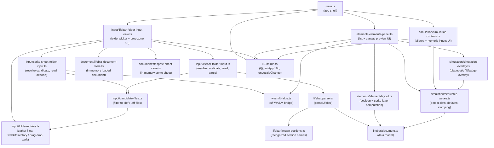
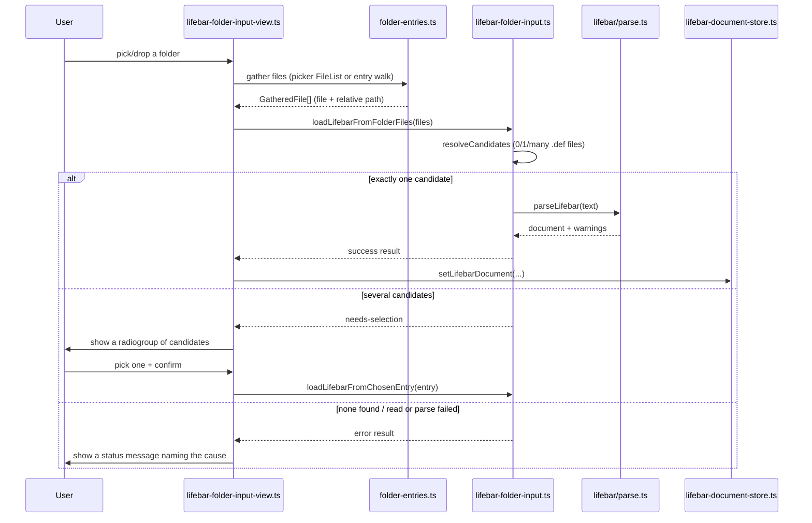
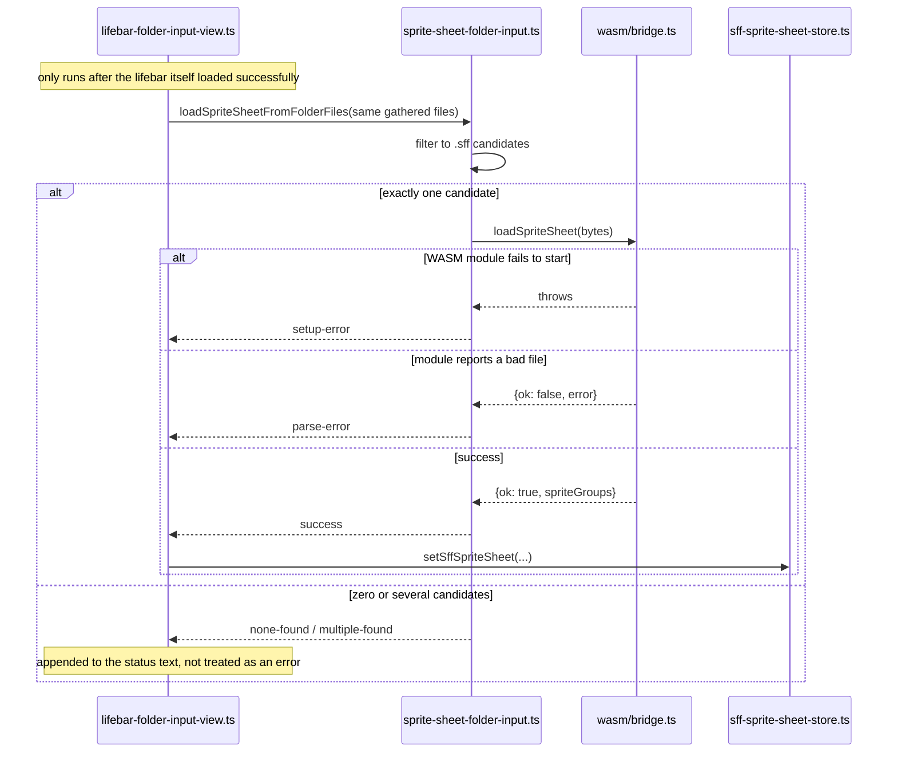

> Generated by /vibe:docs — manual edits will be overwritten; use README for hand-written content.

# Architecture

## Modules

- `main.ts` mounts the `web-ui-kit` app shell and, into its `<main>` region, the folder input view.
- `input/lifebar-folder-input-view.ts` renders the folder picker (`<input webkitdirectory>` + a drag-and-drop zone), the multi-candidate selection prompt, and the status region. It is the only module that touches the DOM. Once the lifebar itself loads, it also resolves the sprite sheet from the same gathered folder listing — see "Data flow: resolving the sprite sheet" below.
- `input/folder-entries.ts` gathers `File`s (with a path relative to the selected folder) from either input path: a flat `FileList` from the directory picker, or a recursive `FileSystemEntry` walk for a dropped folder.
- `input/candidate-files.ts` filters gathered files down to plausible lifebar files (`.def`) or sprite sheets (`.sff`), by extension.
- `input/lifebar-folder-input.ts` is the pure orchestration layer: decide what to do with the gathered files (auto-load the sole candidate, ask the user among several, or report no-files/no-candidate), then read and parse the chosen one.
- `input/sprite-sheet-folder-input.ts` is the sprite sheet equivalent: filter the same gathered files to `.sff` candidates, then read and decode the sole one via `wasm/bridge.ts` — see `.vibe/decisions/003-sprite-sheet-resolved-from-the-same-folder-no-separate-picker.md` for why this reuses the lifebar's own folder listing instead of a second picker.
- `wasm/bridge.ts` (with `wasm/types.ts`) is the bridge to the sibling `sff` library's WebAssembly build: loads `wasm_exec.js` + `sff.wasm` (downloaded via `scripts/download-wasm.mjs`, `npm run wasm:download`, never committed) and exposes typed `loadSpriteSheet`/`resolveSpritePixels` wrappers.
- `lifebar/parse.ts` parses `.def`-style text into a `LifebarDocument`, using `lifebar/known-sections.ts` to decide which sections are modeled versus reported as a skip warning. `lifebar/document.ts` defines the data model.
- `document/lifebar-document-store.ts` holds the currently loaded lifebar document in memory; `document/sff-sprite-sheet-store.ts` holds the currently resolved sprite sheet (file name, raw bytes, decoded metadata) — read by `elements/elements-panel.ts`.
- `elements/element-layout.ts` is pure logic (no DOM): computes where each recognized section draws, from its own raw `pos`/`N.spr`/`N.offset` entries, and resolves each `N.spr` layer against the loaded sprite sheet's metadata into one of three states (no sheet yet, invalid reference, resolved) — see `.vibe/decisions/004-element-layout-convention-and-placeholder-states.md`.
- `elements/elements-panel.ts` renders the element list and a fixed `640×480` canvas preview: batch-decodes every resolved layer's pixels via `wasm/bridge.ts` and draws them at their computed position, with a per-element DOM overlay (not a canvas redraw) carrying the selection highlight and any unresolved/no-sprite/waiting-for-sheet state.
- `simulation/simulated-values.ts` is pure logic (no DOM): `detectSimulatableSlots` scans a loaded document for life/power/combo sections, and `defaultSimulatedValue`/`clampSimulatedValue` hold each kind's default and valid range.
- `simulation/simulation-controls.ts` renders a slider paired with a numeric input for each detected slot, grouped by player, calling back with the clamped value on every change.
- `simulation/simulation-overlay.ts` draws a simulated value as a diagnostic overlay on top of an element's own box in the preview — a fill bar for life/power, a numeric badge for combo — visually distinct from the selection highlight so both can be seen on the same element at once. See `.vibe/decisions/005-simulation-values-shown-as-diagnostic-overlay-not-authentic-rendering.md` for why this is a diagnostic overlay rather than authentic MUGEN bar-fill/font rendering.
- `i18n/i18n.ts` wires the shared `web-ui-kit` i18next integration layer under this app's own namespace (`en.json`/`fr.json`), and exposes `t()` (translate with a default-value fallback), `initAppI18n` (called once from `main.ts`'s bootstrap), and `onLocaleChange`. Every DOM-rendering module reads its own strings through `t()` directly rather than importing an i18next instance. See `.vibe/decisions/007-i18n-integration-approach.md`.

## Data flow: loading a lifebar

Every step above is a plain function call — nothing here is async infrastructure (no worker, no network). The only genuinely asynchronous parts are reading a `File`'s contents (`FileReader`) and, on the drag-and-drop path, walking a dropped directory's entries (`FileSystemDirectoryReader.readEntries`, which the spec requires calling repeatedly until it returns empty).

## Data flow: resolving the sprite sheet

Deliberately reuses the lifebar's own already-gathered folder listing rather than a second file picker — see `.vibe/decisions/003-sprite-sheet-resolved-from-the-same-folder-no-separate-picker.md`. Unlike the lifebar's own multi-candidate flow, several `.sff` candidates do not prompt the user to pick one; the sheet simply stays unresolved and the status text says so.

## Data flow: previewing elements

`main.ts` re-renders `elements/elements-panel.ts` after either store changes (the lifebar loads, or the sprite sheet resolves/fails/is still pending), passing the same selection object each time so an already-selected element stays selected across that re-render.

1. Every recognized section becomes an `ElementLayout` (`element-layout.ts`'s `computeElementLayout`): its `pos` entry as an origin point, plus one `ElementLayer` per `N.spr` entry (offset by the matching `N.offset`, `(0, 0)` otherwise).
2. Each layer is resolved against the sprite sheet's metadata (`resolveLayer`) into `no-sheet` (nothing loaded yet), `invalid` (malformed value, or a group/image the sheet doesn't have), or `resolved` (real sprite metadata). `computeElementBox` unions every layer's box (the real sprite size when resolved, a fixed placeholder size otherwise) into the element's overall highlight box, clamped to the fixed `640×480` canvas so one wild/malformed offset can't distort it.
3. `elements-panel.ts` renders one list button and one absolutely-positioned overlay `
` per element from that box — the overlay, not the canvas, carries the `is-selected` highlight and the `no-sprite`/`unresolved`/`waiting` state classes, since a canvas redraw would need to re-blit everything just to toggle a highlight.
4. Only every *resolved* layer across every element is batch-decoded in one `wasm/bridge.ts` `resolveSpritePixels` call (sffBytes transferred once), then each result is drawn onto the shared canvas at its own computed position.

`spriteGroups === null` (no sheet loaded, or resolution failed) skips step 4 entirely and shows one shared banner message instead of per-element error placeholders — every element stays listed and selectable throughout, since a `.sff` still loading is not a data defect.

## Data flow: simulating values

`main.ts` keeps a `simulatedValues` record (keyed by `SimulatableSlot.key`) alongside the element selection state, persisted across re-renders the same way.

1. When a lifebar loads, `main.ts` calls `detectSimulatableSlots` and seeds every detected slot at its kind's default (`defaultSimulatedValue`) — life/power full, combo zero — so the controls and the preview overlay agree from the very first render.
2. `simulation-controls.ts` renders one slider + numeric input row per slot, grouped by player. Moving either control clamps the raw value (`clampSimulatedValue`) and calls back into `main.ts`, which updates `simulatedValues` and re-renders both the controls (to sync the slider/input pair) and the elements panel.
3. `elements-panel.ts` looks up each rendered section's slot (if any) in `simulatedValues` and, when a value is present, calls `simulation-overlay.ts` to draw the diagnostic overlay at that element's already-computed box — entirely independent of whether the sprite sheet has resolved.

A slot with no entry in `simulatedValues` yet (or a section that isn't simulatable at all) gets no overlay — never a default the user didn't actually choose.

## Data flow: localization

`main.ts`'s bootstrap (`mount()`) awaits `initAppI18n()` before the very first `renderApp` call, so the first paint already shows the resolved locale (browser-detected, or a persisted override) — `renderApp` itself stays synchronous and never calls it, so tests can call `renderApp` directly with deterministic English defaults.

A `<wuik-locale-switcher>` in the toolbar drives the shared i18next instance directly (its `.i18n` property); switching it fires `web-ui-kit`'s own locale-change event. `main.ts` subscribes once to `onLocaleChange` and re-invokes its existing `refreshElementsPanel`/`refreshSimulationControls` closures — the same ones any ordinary data change already uses — so the current element selection and simulated values survive a language switch untouched. `input/lifebar-folder-input-view.ts` (a long-lived view mounted once) subscribes on its own to re-format its currently-shown status text from a small stored status descriptor rather than a pre-formatted string, so an already-displayed message (including an in-progress multi-candidate selection) re-renders correctly in the new language without rebuilding it from scratch.

