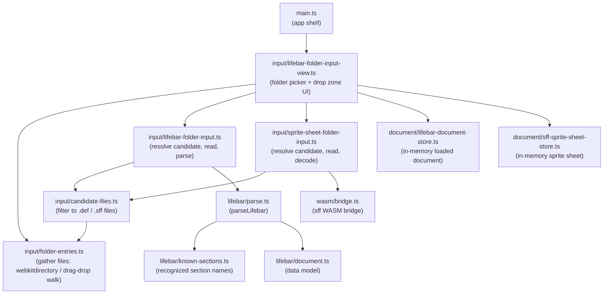
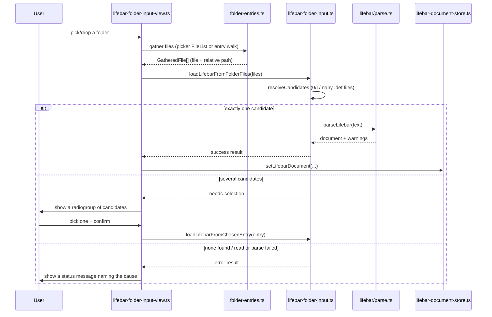
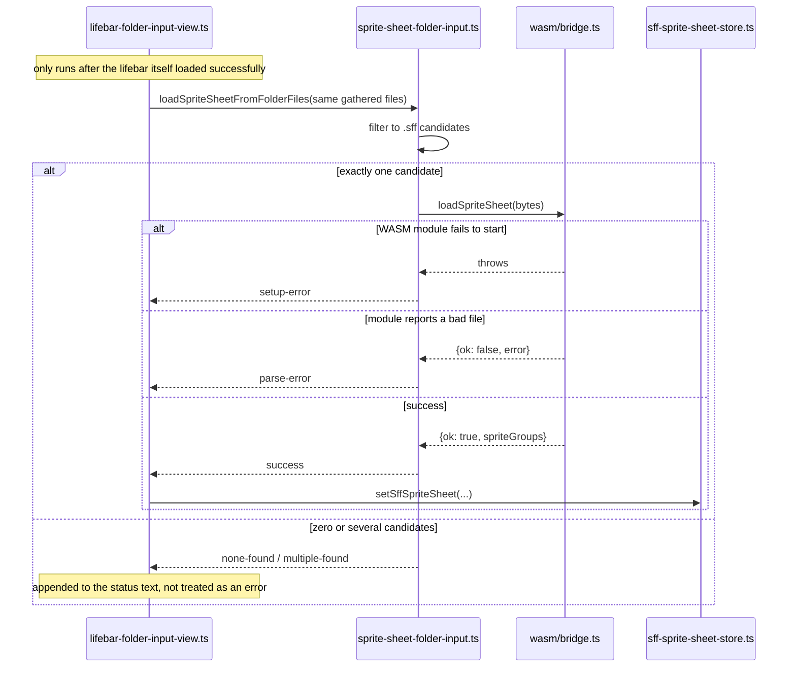

> Generated by /vibe:docs — manual edits will be overwritten; use README for hand-written content.

# Architecture

## Modules

- `main.ts` mounts the `web-ui-kit` app shell and, into its `<main>` region, the folder input view.
- `input/lifebar-folder-input-view.ts` renders the folder picker (`<input webkitdirectory>` + a drag-and-drop zone), the multi-candidate selection prompt, and the status region. It is the only module that touches the DOM. Once the lifebar itself loads, it also resolves the sprite sheet from the same gathered folder listing — see "Data flow: resolving the sprite sheet" below.
- `input/folder-entries.ts` gathers `File`s (with a path relative to the selected folder) from either input path: a flat `FileList` from the directory picker, or a recursive `FileSystemEntry` walk for a dropped folder.
- `input/candidate-files.ts` filters gathered files down to plausible lifebar files (`.def`) or sprite sheets (`.sff`), by extension.
- `input/lifebar-folder-input.ts` is the pure orchestration layer: decide what to do with the gathered files (auto-load the sole candidate, ask the user among several, or report no-files/no-candidate), then read and parse the chosen one.
- `input/sprite-sheet-folder-input.ts` is the sprite sheet equivalent: filter the same gathered files to `.sff` candidates, then read and decode the sole one via `wasm/bridge.ts` — see `.vibe/decisions/003-sprite-sheet-resolved-from-the-same-folder-no-separate-picker.md` for why this reuses the lifebar's own folder listing instead of a second picker.
- `wasm/bridge.ts` (with `wasm/types.ts`) is the bridge to the sibling `sff` library's WebAssembly build: loads `wasm_exec.js` + `sff.wasm` (downloaded via `scripts/download-wasm.mjs`, `npm run wasm:download`, never committed) and exposes typed `loadSpriteSheet`/`resolveSpritePixels` wrappers.
- `lifebar/parse.ts` parses `.def`-style text into a `LifebarDocument`, using `lifebar/known-sections.ts` to decide which sections are modeled versus reported as a skip warning. `lifebar/document.ts` defines the data model.
- `document/lifebar-document-store.ts` holds the currently loaded lifebar document in memory; `document/sff-sprite-sheet-store.ts` holds the currently resolved sprite sheet (file name, raw bytes, decoded metadata) — both for a later screen (the elements panel) to read from.

## Data flow: loading a lifebar

Every step above is a plain function call — nothing here is async infrastructure (no worker, no network). The only genuinely asynchronous parts are reading a `File`'s contents (`FileReader`) and, on the drag-and-drop path, walking a dropped directory's entries (`FileSystemDirectoryReader.readEntries`, which the spec requires calling repeatedly until it returns empty).

## Data flow: resolving the sprite sheet

Deliberately reuses the lifebar's own already-gathered folder listing rather than a second file picker — see `.vibe/decisions/003-sprite-sheet-resolved-from-the-same-folder-no-separate-picker.md`. Unlike the lifebar's own multi-candidate flow, several `.sff` candidates do not prompt the user to pick one; the sheet simply stays unresolved and the status text says so.

